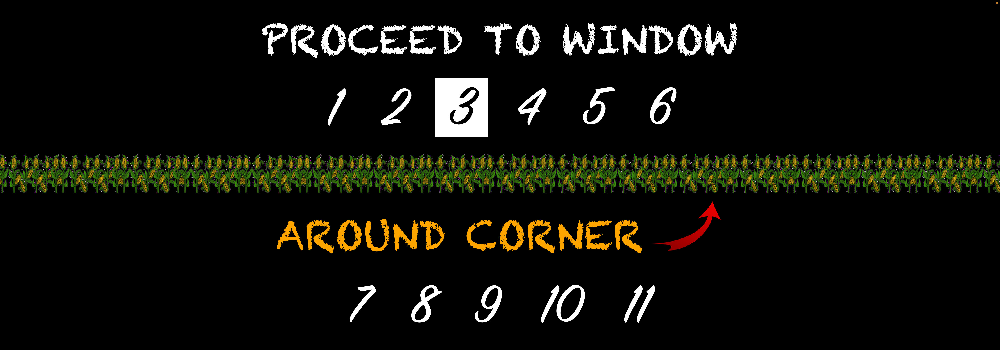

<div id="top" align="center">

[![LinkedIn][linkedin-shield]][linkedin-url]

</div>

<!-- PROJECT LOGO -->
<br />
<div align="center">
  <a href="https://github.com/Jonathan-Bryant19/line-program">
    
  </a>


<h1 align="center">Customer Line Management Program</h3>

  <p align="center">
    This application was built on request from a local amusement park. They needed a system to alert customers when a ticket window becomes available. The app was built to replicate a design supplied by the customer.
    <br />
    <br />
    <a href="https://www.youtube.com/watch?v=omjyefhzDW0">• View Live Demo •</a>
  </p>
  <br />
</div>


<!-- TABLE OF CONTENTS -->
<details>
  <summary>Table of Contents</summary>
  <ol>
    <li>
      <a href="#about-the-project">About The Project</a>
      <ul>
        <li><a href="#built-with">Built With</a></li>
      </ul>
    </li>
    <li>
      <a href="#getting-started">Getting Started</a>
      <ul>
        <li><a href="#installation">Installation</a></li>
      </ul>
    </li>
    <li><a href="#roadmap">Roadmap</a></li>
    <li><a href="#usage">Usage</a></li>
    <li><a href="#contact">Contact</a></li>
  </ol>
</details>
<br />


<!-- ABOUT THE PROJECT -->
## About The Project


This project was built to help process customers waiting in line to buy tickets at a local amusement park. The ticket windows wrapped around a corner and several windows were out of view, so the client created a [mockup](./client-mockup/mockup-1.png) [(written description)](./client-mockup/mockup-2.png) outlining how they wanted to solve the problem. 

Based on the mockup, I designed a system using Python and a Rasperry Pi. Physical buttons mounted near each cashier were wired back to the Rasperry Pi's GPIO pins, allowing for up to 11 cashiers to use the system at the same time.

<p align="right">(<a href="#top">back to top</a>)</p>


### Built With

* [Python](https://www.python.org/)
* [Raspberry Pi](https://www.raspberrypi.org/)

<p align="right">(<a href="#top">back to top</a>)</p>


<!-- GETTING STARTED -->
## Getting Started

Follow these steps to get a local copy up and running.


### Installation

Fork and clone the repo. In the root directory you will see `demo.py` and `main.py`. The `demo.py` file is written to demo the applciation on a regular computer while the `main.py` file is written to run on a Raspberry Pi. Currently, the `main.py` file has code targeting the GPIO pins commented out and all inputs are tied to a standard keyboard. If you would like to experiment with the application using a Raspberry Pi, comment out the current key bindings and uncomment the GPIO references.

To run the program from the terminal, enter the following while in the root directory:
```
python3 demo.py
```
or 
```
python3 main.py
```


<p align="right">(<a href="#top">back to top</a>)</p>


<!-- ROADMAP -->
## Roadmap

An image of the original mockup can be found [here](./client-mockup/mockup-1.png) and an image of the written description can be found [here](./client-mockup/mockup-2.png).

Here is an image of the hardware prototype:
<br />


And here is the installed hardware:
<br />


<p align="right">(<a href="#top">back to top</a>)</p>


<!-- USAGE EXAMPLES -->
## Usage

Here is a short GIF demonstrating the application's basic functionality:


And here is a short GIF of the application in use ([full video here](https://www.youtube.com/watch?v=omjyefhzDW0)):


<p align="right">(<a href="#top">back to top</a>)</p>


<!-- CONTACT -->
## Contact

Jonathan Bryant - jbryant9@gmail.com, spectrum19tech@gmail.com

Project Link: [https://github.com/Jonathan-Bryant19/line-program](https://github.com/Jonathan-Bryant19/line-program)

<p align="right">(<a href="#top">back to top</a>)</p>


<!-- MARKDOWN LINKS & IMAGES -->
<!-- https://www.markdownguide.org/basic-syntax/#reference-style-links -->

[linkedin-shield]: https://img.shields.io/badge/-LinkedIn-black.svg?style=for-the-badge&logo=linkedin&colorB=555
[linkedin-url]: https://www.linkedin.com/in/jonathan-bryant19/